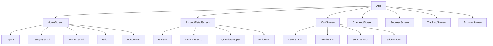

# I-001 — Phân tích UI spec

Khi nhận yêu cầu phân tích UI spec, tạo:

## 1. Component Tree



## 2. Data Model

```typescript
interface Product {
  id: string; name: string; price: number;
  oldPrice?: number; unit: string; shop: string;
  voucher?: string; rating: number; distance: string;
  isFresh: boolean; isOutOfStock: boolean;
  variants: ProductVariant[];
}

interface CartItem {
  productId: string; name: string; variant: string;
  price: number; quantity: number; image: string;
}

interface Voucher {
  code: string; label: string; desc: string;
  type: 'percent' | 'fixed' | 'shipping';
  value?: number; cap?: number;
}
```

## 3. Flow Diagram

```
Home → Product Detail → Cart → Checkout → Success → Tracking → Home
```

## 4. State Analysis

Mỗi màn hình: loading, empty, error, success states.
